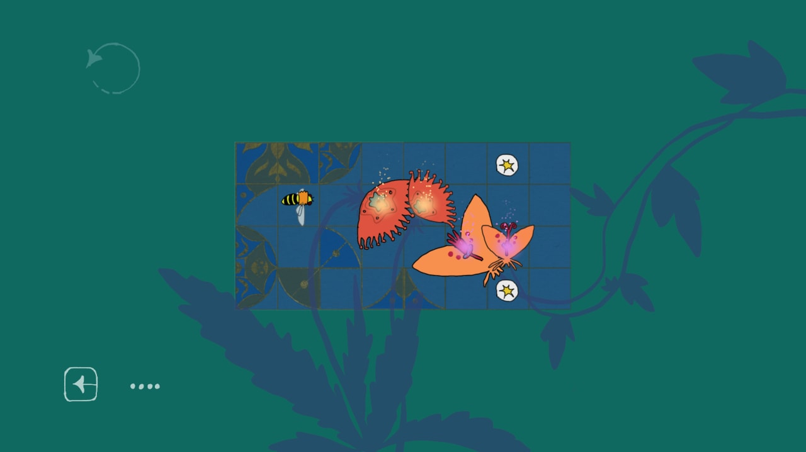
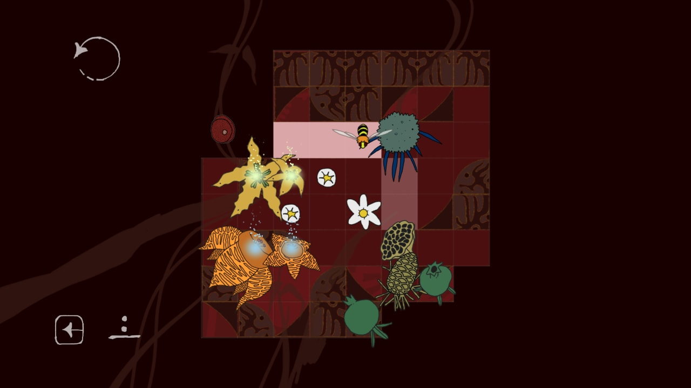
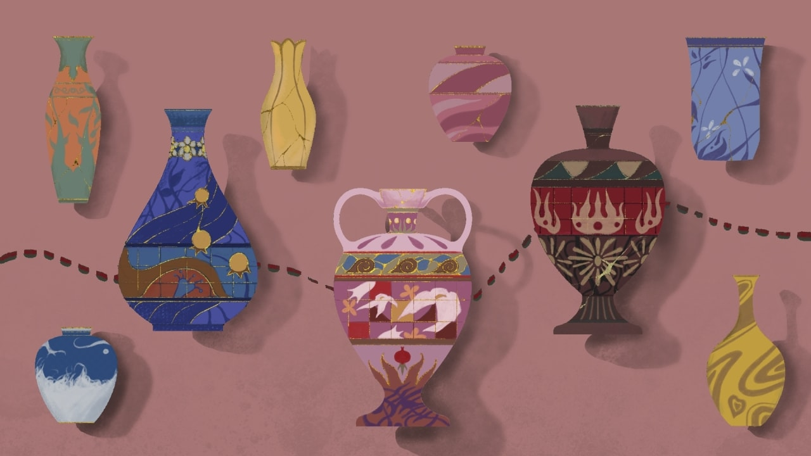

# Nectar Nexus

🕹️ **[Play in browser](https://play.ayu.land/Nectar-Nexus)** | 🌐 **[LD entry page](https://ldjam.com/events/ludum-dare/55/nectar-nexus)** | 📄 **[Hints and solutions](misc/solutions/README.md)**

Welcome to *Nectar Nexus* — a wonderful puzzle game where a whimsical porcelain garden experience is about to unfold.

In this game, you will explore the mystery of blooming flowers. Each level is a gorgeous garden.

Your task is to use the bloom of flowers to summon bees and help them pollinate other flowers. Bees are an important Nexus to this garden.

They create a special bond with the flowers by gathering nectar. You need to subtly direct the movement of the bees, allowing them to pass sweet nectar between flowers.

Each successful call and pollination will add life to the garden and make it glow with even more brilliant colors.

However, there is not only beautiful flowers, but also something hidden in the plants…

Waiting for you to explore!

