# Hints and Solutions to _Nectar Nexus_

The solution to each puzzle will be given as a string of digits:
- Digit 0 denotes an empty step (without triggering blossoms);
- Digit 1-9 denote the triggering of a blossom of that respective number — refer to the screenshots attached.

This string can be typed directly into the game screen to progress through each step. For clarity, digits are displayed in groups of four.

The rule for turning, in case you need it:

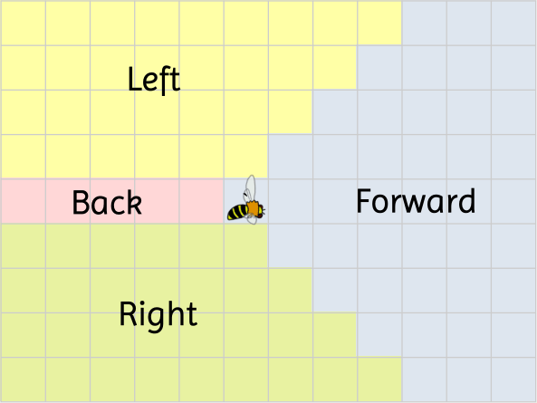

## 01

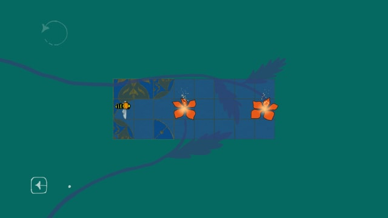

**0000 000**

## 02

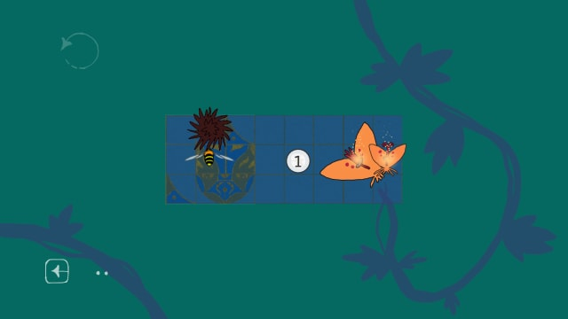

**1000 00**

## 03

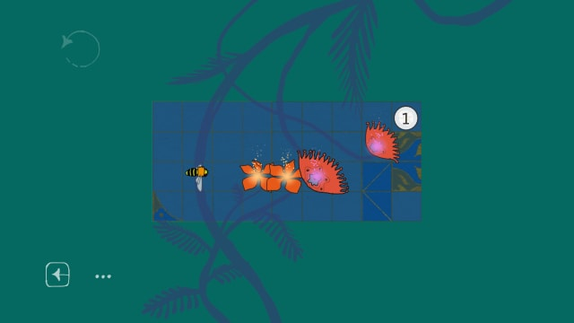

**000 000 1**

## 04

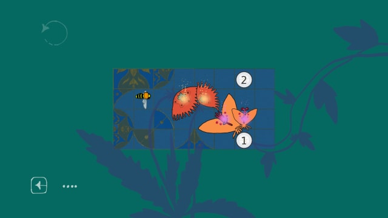

**0000 12**

## 05

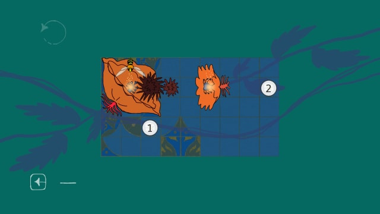

**0000 2000 100**

## 06

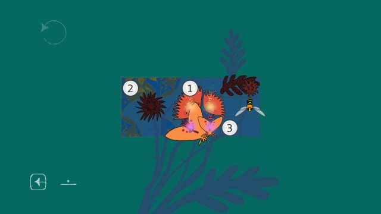

**0 2000 1 30**

## 07

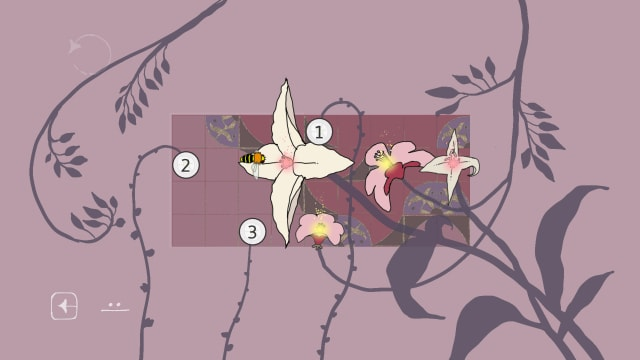

**000 000 200 000 30 1**

## 08

  
Hint

  Bees need to align on one row. There is only one column at which this can be achieved by blossom 1.

  **00 1 20000**

## 09

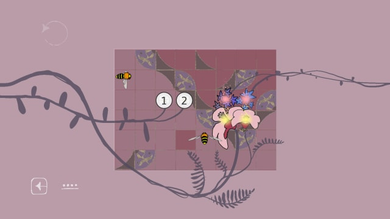

  
Hint

  Spot a chance similar to puzzle 08.

  **00 10 20000**

## 10

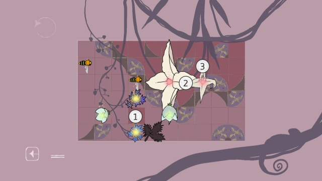

  
Hint

  The vertical pair needs a direct, straight route through them (because 4 blossoms will be required otherwise).
  Which bee is the one to do this? Quickly eliminating some of the obscure, infeasible options, we are left with the lower bee doing a backward turn.
  When should this happen? A lockstep can be carefully crafted so that the upper bee ends up at the correct row.

  **0000 20000 100 3000 0000**

## 11

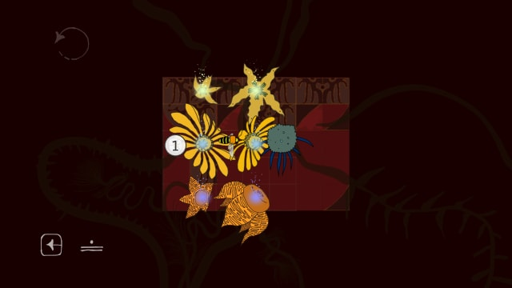

**000 100 000**

## 12

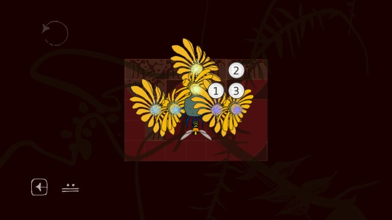

**300 2 1000**

## 13

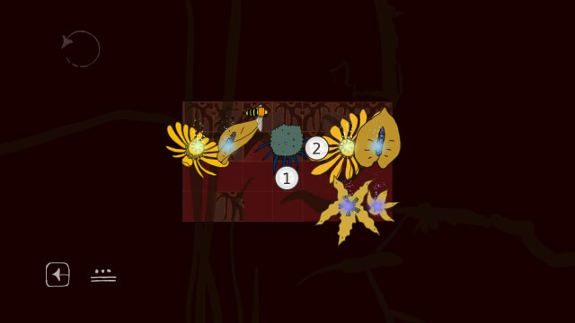

**010 200 000**

## 14

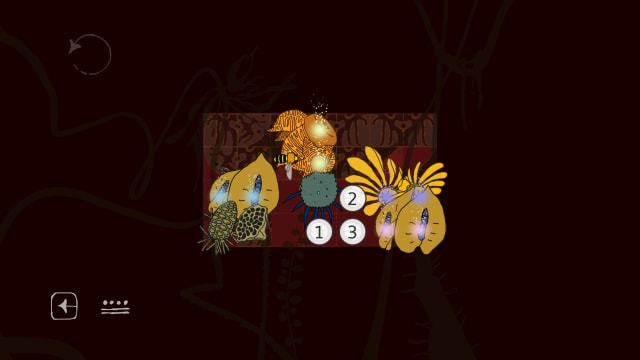

  
Hint 1

  In which direction should the bee enter the weeds?

  

    
Hint 2

    Right (no pun intended). This implies that a backward turn needs to take place with blossom 2.

    **1 300 2000 000**
  

## 15

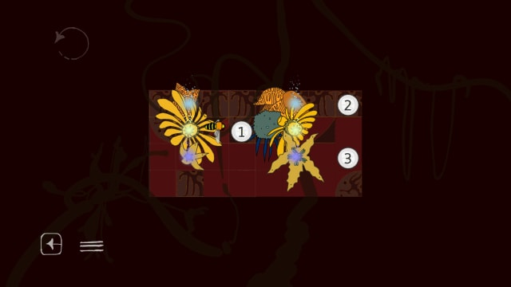

**000 100 2 3000**

## 16

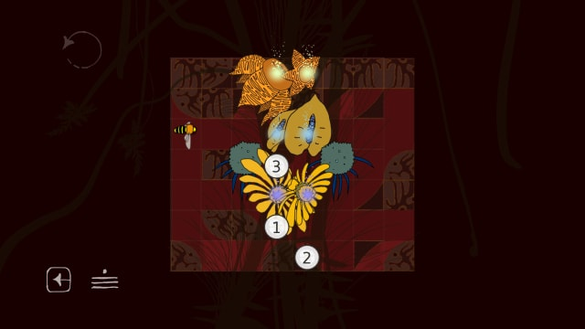

  
Hint

  The bee needs to enter the weeds facing right (other options quickly turn out infeasible). This requires two blossoms — which two?

  **0 2 300 10**

## 17

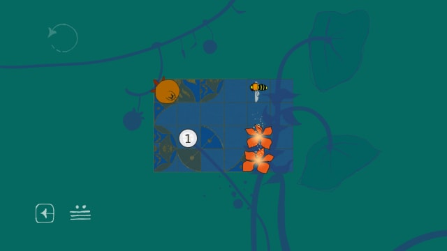

**000 000 100**

## 18

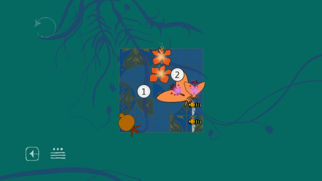

**0000 1 2000**

## 19

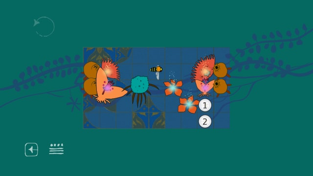

**0000 0000 0000 0000 000 100 20000**

## 20

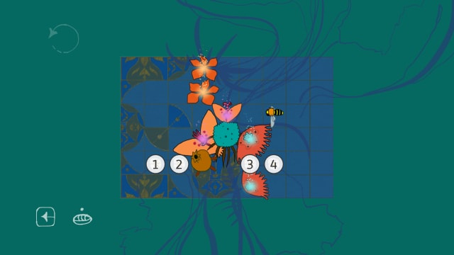

  
Hint

  The purple-glowing (diagonal) pollen pair must be visited by a single bee — the initial one.

  The rebounding obstacle turns useful afterwards.

  **000 2 4 1 3 000**

## 21

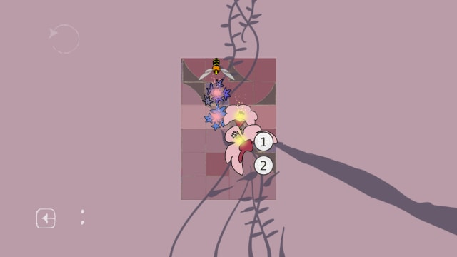

**00000 2 100**

## 22

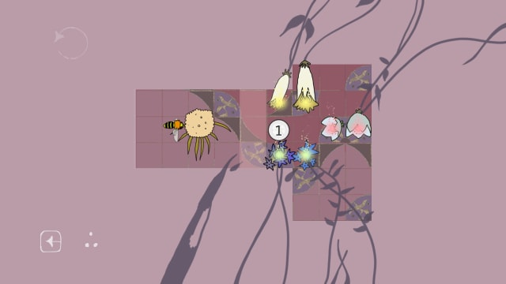

**00 1000**

## 23

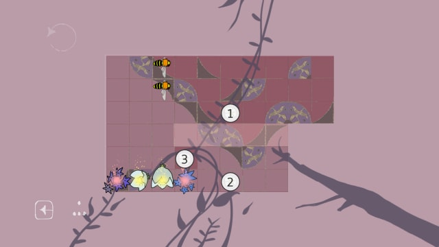

**00 100 2000 300 000**

## 24

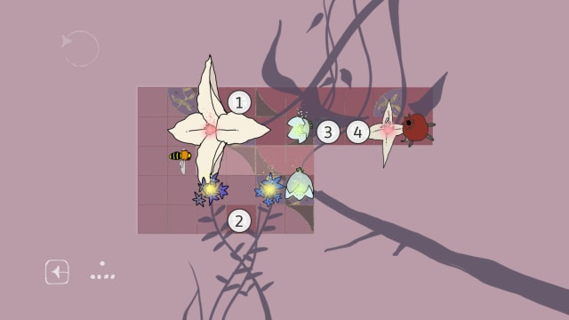

**0 2 400 10 300 000 000**

## 25

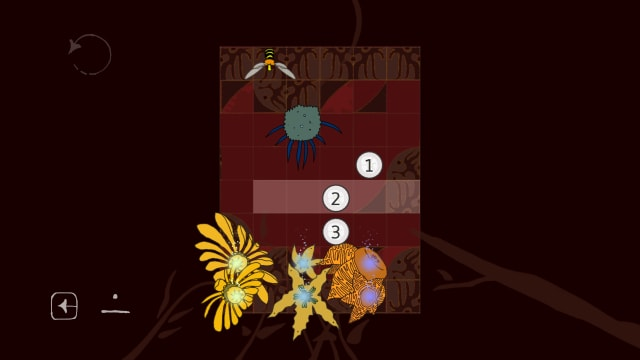

**0 1 20 30000**

## 26

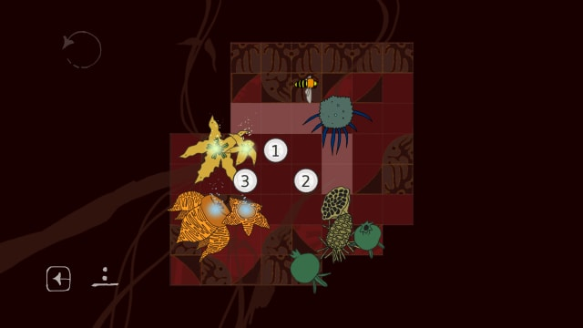

**00 1 2 300 000**

## 27

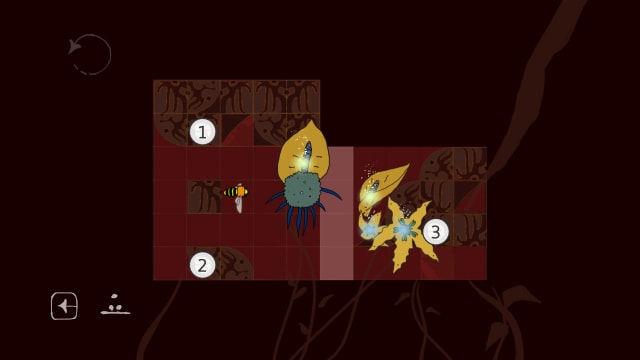

  
Hint

  <i>Sacrifices must be made</i>. Which of them?

  One of the flowers must be saved for the final turn. Which of them?

  **0 1 20000 30000**

## 28

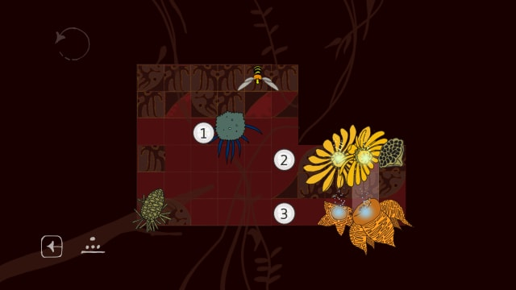

  
Hint

  Solution 1: **00 100 2 3000 0000**
  Solution 2: **00 1 20000 300 000** (one bee gets eaten after fulfilling its duty)

## 29

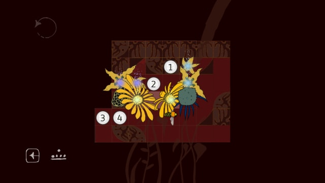

  
Hint

  Sacrifices must <i>not</i> be made. This leaves us with a single choice for the first steps.

  **0 2 1 30 400**

## 30

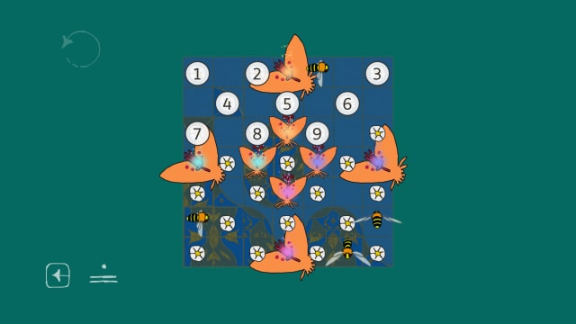

  
Hint

  The asymmetries secretly points to a single first step.

  **20 50**

Thanks for playing <3
